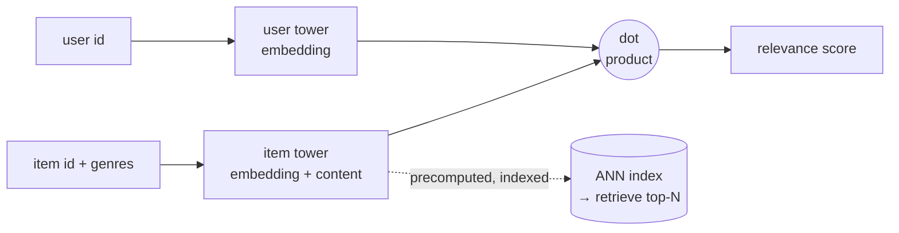

# two-tower-recommender

**A two-tower neural retrieval recommender, implemented from scratch in NumPy** —
embedding towers, BPR loss, hand-derived gradients (numerically checked) — with a
leave-one-out evaluation harness that shows it beats a popularity baseline on
synthetic data, gated in CI, plus a one-command MovieLens benchmark for real data.

> **What this is.** An independent reference implementation on **synthetic and
> public (MovieLens) data**, built to demonstrate two-tower retrieval and its
> offline evaluation. It contains no employer code or data. Every number below is
> reproducible with `make eval`.

---

## Why two-tower retrieval

Large-scale recommenders can't score millions of items per request with a heavy
model. The standard pattern is a cheap **retrieval** stage — a *two-tower* model
that embeds users and items into one space so relevance is a dot product — that
narrows millions of items to a few hundred, which a heavier ranker then re-scores.
The two-tower trick: **item vectors are precomputed and indexed**, so serving is
one user-tower pass plus an approximate-nearest-neighbor lookup.



## From scratch — and correct

The model ([`model.py`](src/twotower/model.py)) is pure NumPy: embedding tables, a
content-feature projection on the item tower, the BPR pairwise loss, and
**analytic gradients derived by hand** (the derivation is in
[docs/model.md](docs/model.md)). This is deliberate — it shows the mechanics
rather than hiding them behind `model.fit()`.

To prove the gradients are actually right, `tests/test_model.py` runs a
**numerical gradient check** (central differences vs. the analytic gradient,
max abs error < 1e-6). A PyTorch port is the documented production path.

## Evaluation — does it beat "just recommend popular items"?

Leave-one-out protocol (hold out each user's last interaction; rank it against
100 sampled negatives), reporting HitRate@K and NDCG@K for the model **and** a
popularity baseline on identical candidate sets. Full methodology:
[docs/evaluation.md](docs/evaluation.md).

**Latest run (`make eval`, synthetic, seed 0, ~0.5s):**

| Metric | Two-tower | Popularity baseline |
|---|---|---|
| HitRate@5 | **0.32** | 0.10 |
| NDCG@5 | **0.21** | 0.06 |
| HitRate@10 | **0.47** | 0.16 |
| NDCG@10 | **0.257** | 0.077 |

**NDCG@10 uplift over popularity: 3.3×.** Regression gates in
[`eval/thresholds.yaml`](eval/thresholds.yaml) fail CI if this collapses.

## MovieLens 100k

```bash
make data                 # download MovieLens 100k (opt-in; GroupLens public dataset)
make train-movielens      # train on real ratings; genres feed the item tower
```
The identical eval applies; the synthetic run is what CI gates on (offline).

## Quickstart

```bash
make quickstart           # install + tests (incl. gradient check) + gated eval — offline
# or individually:
make test                 # pytest
make train                # train on synthetic, print model vs popularity
make eval                 # train + evaluate + regression gates
```

## Repository layout

```
src/twotower/
  data.py        Dataset; synthetic latent-factor generator; MovieLens loader; LOO split
  model.py       TwoTowerModel — towers, BPR loss, hand-derived gradients, save/load
  negatives.py   uniform negative sampling
  metrics.py     HitRate@K, NDCG@K, rank-of-positive
  evaluate.py    leave-one-out eval; model vs. popularity on identical candidates
  train.py       BPR training loop + CLI
scripts/download_movielens.py   opt-in dataset fetch
eval/                            runner, thresholds, CI gates
tests/                           gradient check, metrics, end-to-end beats-baseline
docs/                            the math (model.md) and the methodology (evaluation.md)
```

## What I'd change in v2

- **PyTorch port** (same interface) for autograd, GPU, larger embeddings.
- **Sampled-softmax / in-batch negatives** with popularity correction.
- **A real ANN index** (FAISS/hnswlib) for retrieval + latency numbers.
- **Sequence-aware user tower** over recent interactions.
- **Calibration & slice metrics** (cold-start users, long-tail items).

---

*Independent reference implementation · synthetic + public data · not affiliated
with any employer. Licensed under [MIT](LICENSE).*
